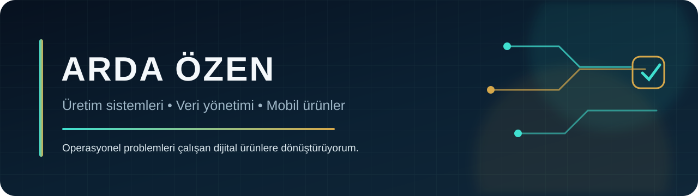

  

  Üretim planlama ve operasyon takibi, veri yönetimi ve mobil ürün geliştirme kesişiminde çalışıyorum. 
  Sahadaki gerçek ihtiyaçları sade, ölçülebilir ve kullanılabilir dijital ürünlere dönüştürüyorum.

  
  
  
  
  
  
  
  

## Mağazadaki mobil ürünler

<table>
<tr>
<td width="50%" valign="top">
  
  <h3 align="center"><a href="https://github.com/ardaaozen/DualVlog">DualVlog</a></h3>
  
Ön ve arka kamerayı tek çekimde birleştiren, içerik üreticileri için tasarlanmış iPhone video uygulaması.

  

</td>
<td width="50%" valign="top">
  
  <h3 align="center"><a href="https://github.com/ardaaozen/Nur-Vakti-App">Nur Vakti · Android</a></h3>
  
Namaz vakitleri, Kur’an, kıble, zikir, widget ve günlük içerikleri tek deneyimde buluşturan Android uygulaması.

  

</td>
</tr>
<tr>
<td width="50%" valign="top">
  
  <h3 align="center"><a href="https://github.com/ardaaozen/NurVaktiIOS">Nur Vakti · iOS</a></h3>
  
iPhone ve Apple Watch için namaz vakitleri, Kur’an, zikir, widget ve günlük içerik deneyimi.

  

</td>
<td width="50%" valign="top">
  
  <h3 align="center"><a href="https://github.com/ardaaozen/AviTrail-iOS">AviTrail</a></h3>
  
Kuşları fotoğraf veya sesle tanımaya, gözlemleri kaydetmeye ve yerel liglere katılmaya odaklanan iOS ürünü.

  

</td>
</tr>
<tr>
<td width="50%" valign="top">
  
  <h3 align="center"><a href="https://github.com/ardaaozen/MiraKnit">MiraKnit</a></h3>
  
Adım adım örgü dersleri, modern tarifler ve kişisel proje arşivi sunan iPhone uygulaması.

  

</td>
<td width="50%" valign="top">
  
  <h3 align="center"><a href="https://github.com/ardaaozen/FacetPDF-Studio-Showcase">FacetPDF Studio</a></h3>
  
iPhone ve iPad için cihaz üzerinde çalışan PDF okuma, düzenleme, tarama ve dönüştürme stüdyosu.

  

</td>
</tr>
</table>

## Ürün ve operasyon sistemleri

<table>
<tr>
<td width="50%" valign="top">
  
  <h3 align="center"><a href="https://github.com/ardaaozen/aymali-aluminyum-erp-tanitim">Aymalı Alüminyum ERP</a></h3>
  
Teklif, üretim, stok, satın alma ve finans operasyonlarını tek masaüstü akışında birleştiren iş sistemi.

</td>
<td width="50%" valign="top">
  
  <h3 align="center"><a href="https://github.com/ardaaozen/PusulaAkademi-Showcase">Pusula Akademi</a></h3>
  
Öğrenci, akademik süreç ve finans operasyonlarını yöneten .NET, WPF ve SQL Server tabanlı masaüstü sistem.

</td>
</tr>
<tr>
<td width="50%" valign="top">
  
  <h3 align="center"><a href="https://github.com/ardaaozen/verimium-app">Verimium</a></h3>
  
Tarla, hayvancılık, finans, uydu verileri ve yapay zekâ içgörülerini birleştiren mobil tarım platformu.

</td>
<td width="50%" valign="top">
  
  <h3 align="center"><a href="https://github.com/ardaaozen/merasim-showcase">Merasim</a></h3>
  
Özel anları zarif, hareketli ve paylaşılabilir davetiyelere dönüştüren SwiftUI tasarım stüdyosu.

</td>
</tr>
<tr>
<td width="50%" valign="top">
  
  <h3 align="center"><a href="https://github.com/ardaaozen/drink-journal">Drink Journal</a></h3>
  
İçecekleri, alkolsüz günleri ve bunlara eşlik eden anıları kişisel bir takvimde kaydeden iPhone günlüğü.

</td>
<td width="50%" valign="top">
  
  <h3 align="center"><a href="https://github.com/ardaaozen/MyCombine">MyCombine</a></h3>
  
Dijital dolap, yapay zekâ destekli kombin planlama ve bilinçli alışveriş için kişisel stil asistanı.

</td>
</tr>
</table>

Ürün tasarımı • Mobil geliştirme • Operasyon sistemleri • Veri odaklı karar desteği

